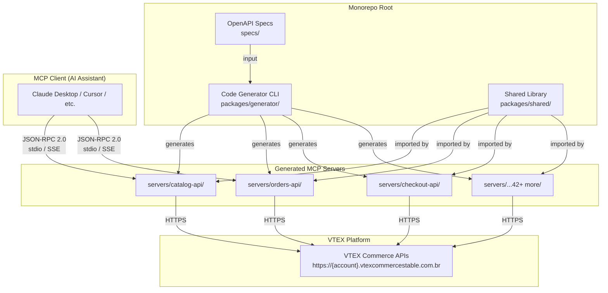
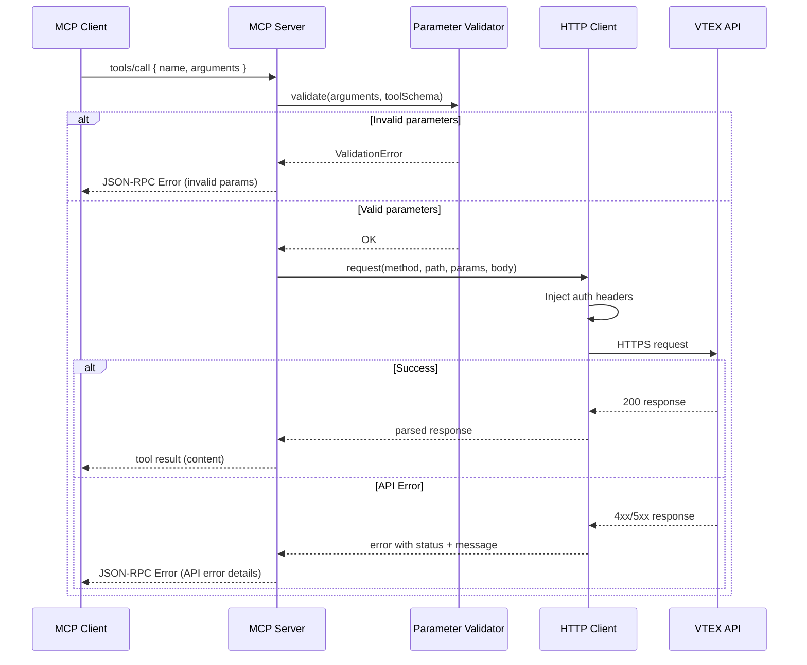
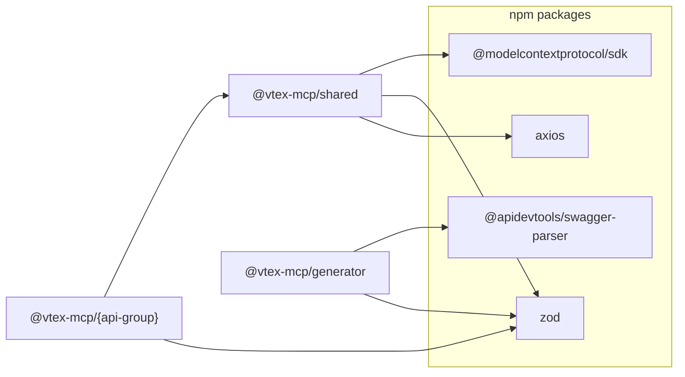
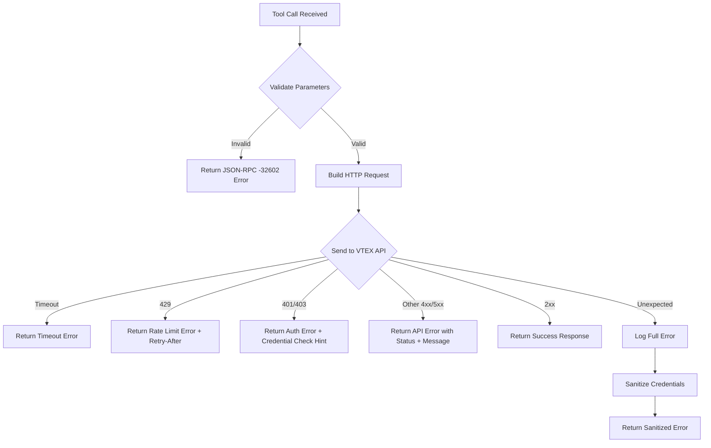

# Design Document: VTEX MCP Servers

## Overview

This project delivers a monorepo of MCP (Model Context Protocol) servers that expose every public VTEX e-commerce API to AI assistants. Each VTEX API group maps to a standalone MCP server package, generated from official VTEX OpenAPI specifications. The architecture prioritizes code generation over hand-written boilerplate: a generator CLI reads OpenAPI specs and scaffolds fully functional MCP server packages with validated tool definitions, typed parameters, and error handling.

The system is built in TypeScript, organized as a pnpm workspace monorepo, and designed so each server can be independently published to npm and run via `npx`. A shared library provides the HTTP client, authentication, validation, and MCP protocol plumbing that all servers depend on.

Key design decisions:
- **pnpm workspaces** over npm/yarn for faster installs, strict dependency isolation, and native workspace protocol support
- **Code generation from OpenAPI specs** to ensure tools stay in sync with VTEX platform changes and reduce manual maintenance across 42+ servers
- **@modelcontextprotocol/sdk** as the MCP protocol implementation to avoid reimplementing JSON-RPC 2.0 and protocol handshakes
- **Zod** for runtime parameter validation, generated from OpenAPI JSON Schema constraints
- **Single shared HTTP client** (axios) with interceptors for auth, retry, and timeout logic

## Architecture

### High-Level Architecture Diagram



### Request Flow



### Transport Architecture

Each MCP server supports two transport modes selected via CLI flag:

1. **stdio (default)**: The server reads JSON-RPC messages from stdin and writes responses to stdout. This is the standard mode for local MCP clients like Claude Desktop and Cursor.

2. **HTTP/SSE**: The server starts an HTTP server exposing `/sse` for server-to-client events and `/messages` for client-to-server requests. This enables remote deployment scenarios.

Both transports are provided by `@modelcontextprotocol/sdk` and share the same tool handler logic.

## Components and Interfaces

### 1. Shared Library (`packages/shared/`)

The shared library is the foundation all servers depend on. It exports:

```typescript
// packages/shared/src/index.ts

// --- Configuration ---
export interface VtexConfig {
  accountName: string;
  environment: string;       // default: "vtexcommercestable"
  appKey?: string;
  appToken?: string;
  authToken?: string;        // alternative auth via VtexIdclientAutCookie
}

export function loadConfig(): VtexConfig;
// Reads from env vars: VTEX_ACCOUNT_NAME, VTEX_APP_KEY, VTEX_APP_TOKEN,
// VTEX_ENVIRONMENT, VTEX_AUTH_TOKEN. Throws with missing var names if required vars absent.

// --- HTTP Client ---
export function createHttpClient(config: VtexConfig): AxiosInstance;
// Pre-configured with:
//   - baseURL: https://{accountName}.{environment}.com.br
//   - 30s timeout
//   - Auth headers (X-VTEX-API-AppKey/AppToken or VtexIdclientAutCookie)
//   - Response interceptor for error normalization

// --- Error Handling ---
export class VtexApiError extends Error {
  constructor(
    public statusCode: number,
    public endpoint: string,
    public vtexMessage: string,
    public retryAfter?: number
  );
}

export function formatMcpError(error: unknown): { content: Array<{ type: "text"; text: string }> ; isError: true };
// Sanitizes errors: strips credentials, includes status code, endpoint, and actionable message.
// Special handling for 401/403 (suggest checking credentials), 429 (include retry-after), timeouts.

// --- Validation ---
export function validateParams(
  params: Record<string, unknown>,
  schema: ZodSchema
): { success: true; data: Record<string, unknown> } | { success: false; errors: string[] };

// --- Pagination ---
export interface PaginationParams {
  page?: number;
  pageSize?: number;
  from?: number;
  to?: number;
}

export interface PaginatedResponse<T> {
  data: T[];
  pagination: {
    page: number;
    pageSize: number;
    total?: number;
    hasMore: boolean;
  };
}

// --- MCP Server Factory ---
export function createMcpServer(options: {
  name: string;
  version: string;
  tools: ToolDefinition[];
}): McpServerInstance;
// Wraps @modelcontextprotocol/sdk Server with tool registration and transport setup.

export interface ToolDefinition {
  name: string;                          // e.g., "catalog_getProduct"
  description: string;                   // summary + HTTP method + path
  inputSchema: ZodSchema;               // Zod schema for parameter validation
  handler: (params: Record<string, unknown>) => Promise<ToolResult>;
}

export interface ToolResult {
  content: Array<{ type: "text"; text: string }>;
  isError?: boolean;
}
```

### 2. Code Generator (`packages/generator/`)

The generator CLI reads an OpenAPI spec and produces a complete MCP server package.

```typescript
// packages/generator/src/index.ts

export interface GeneratorOptions {
  specPath: string;          // path to OpenAPI spec file
  outputDir: string;         // target directory under servers/
  packageName: string;       // npm package name, e.g., "@vtex-mcp/catalog-api"
  serverName: string;        // human-readable name, e.g., "VTEX Catalog API"
}

export async function generateServer(options: GeneratorOptions): Promise<void>;
// 1. Parse OpenAPI spec (using @apidevtools/swagger-parser)
// 2. Extract operations → ToolDefinition[]
// 3. Generate Zod schemas from JSON Schema parameter definitions
// 4. Generate tool handler functions
// 5. Generate server entry point (src/index.ts)
// 6. Generate package.json, tsconfig.json, README.md, Dockerfile

export function parseOpenApiSpec(specPath: string): Promise<ParsedSpec>;
export function operationToTool(operation: ParsedOperation, apiGroupPrefix: string): ToolDefinition;
export function jsonSchemaToZod(schema: JSONSchema): string;
// Converts JSON Schema to Zod schema code string, handling:
//   - required/optional fields
//   - enum constraints
//   - string pattern/minLength/maxLength
//   - nested objects and arrays
//   - default values
```

### 3. Individual MCP Server (`servers/{api-group}/`)

Each generated server follows an identical structure:

```typescript
// servers/{api-group}/src/index.ts
import { createMcpServer, loadConfig, createHttpClient } from "@vtex-mcp/shared";
import { tools } from "./tools.js";

const config = loadConfig();
const httpClient = createHttpClient(config);
const server = createMcpServer({
  name: "vtex-{api-group}-mcp",
  version: "1.0.0",
  tools: tools(httpClient),
});

// CLI entry point with transport selection
server.start();
```

```typescript
// servers/{api-group}/src/tools.ts
import { ToolDefinition } from "@vtex-mcp/shared";
import { z } from "zod";
import type { AxiosInstance } from "axios";

export function tools(http: AxiosInstance): ToolDefinition[] {
  return [
    {
      name: "catalog_getProduct",
      description: "Get product by ID. GET /api/catalog/pvt/product/{productId}",
      inputSchema: z.object({
        productId: z.number().describe("The product ID"),
      }),
      handler: async (params) => {
        const response = await http.get(`/api/catalog/pvt/product/${params.productId}`);
        return { content: [{ type: "text", text: JSON.stringify(response.data, null, 2) }] };
      },
    },
    // ... more tools generated from OpenAPI spec
  ];
}
```


### 4. CLI Entry Point

Each server's `bin` script handles transport selection:

```typescript
// servers/{api-group}/src/cli.ts
#!/usr/bin/env node
import { parseArgs } from "node:util";
import { createMcpServer, loadConfig, createHttpClient } from "@vtex-mcp/shared";
import { tools } from "./tools.js";

const { values } = parseArgs({
  options: {
    transport: { type: "string", default: "stdio" },
    port: { type: "string", default: "3000" },
  },
});

const config = loadConfig();
const httpClient = createHttpClient(config);
const server = createMcpServer({
  name: "vtex-{api-group}-mcp",
  version: "1.0.0",
  tools: tools(httpClient),
});

if (values.transport === "http") {
  server.startHttp({ port: parseInt(values.port!, 10) });
} else {
  server.startStdio();
}
```

### Component Dependency Graph



## Data Models

### OpenAPI Spec → Tool Definition Mapping

| OpenAPI Concept | MCP Tool Concept | Example |
|---|---|---|
| `operationId` | Tool name suffix | `getProduct` → `catalog_getProduct` |
| `summary` | Tool description (line 1) | "Get product by ID" |
| `{method} {path}` | Tool description (line 2) | "GET /api/catalog/pvt/product/{productId}" |
| Path parameters | Required input properties | `productId: z.number()` |
| Query parameters | Optional input properties | `page: z.number().optional().default(1)` |
| Request body schema | Nested input object | `body: z.object({...})` |
| Response 2xx | Tool result content | `{ type: "text", text: JSON.stringify(data) }` |
| Response 4xx/5xx | Error responses | `VtexApiError` with status + message |
| Parameter `enum` | Zod enum constraint | `z.enum(["active", "inactive"])` |
| Parameter `pattern` | Zod regex constraint | `z.string().regex(/^[A-Z]{2}$/)` |
| Parameter `minLength`/`maxLength` | Zod string constraints | `z.string().min(1).max(100)` |

### Generated Package Structure

```
servers/{api-group}/
├── src/
│   ├── cli.ts              # CLI entry point with transport selection
│   ├── index.ts            # Server setup and tool registration
│   └── tools.ts            # Generated tool definitions with Zod schemas
├── package.json            # Scoped package with bin entry
├── tsconfig.json           # Extends root tsconfig with project references
├── Dockerfile              # Minimal Node.js container
└── README.md               # Auto-generated tool documentation
```

### Monorepo Directory Structure

```
vtex-mcp-servers/
├── packages/
│   ├── shared/                    # @vtex-mcp/shared
│   │   ├── src/
│   │   │   ├── config.ts          # Environment variable loading
│   │   │   ├── http-client.ts     # Axios instance factory
│   │   │   ├── errors.ts          # VtexApiError + formatMcpError
│   │   │   ├── validation.ts      # Zod-based parameter validation
│   │   │   ├── pagination.ts      # Pagination types and defaults
│   │   │   ├── server-factory.ts  # MCP server creation wrapper
│   │   │   └── index.ts           # Public API barrel export
│   │   ├── package.json
│   │   └── tsconfig.json
│   └── generator/                 # @vtex-mcp/generator
│       ├── src/
│       │   ├── cli.ts             # Generator CLI entry point
│       │   ├── parser.ts          # OpenAPI spec parser
│       │   ├── schema-converter.ts # JSON Schema → Zod code
│       │   ├── tool-generator.ts  # Operation → ToolDefinition
│       │   ├── package-generator.ts # Scaffold package files
│       │   └── index.ts
│       ├── package.json
│       └── tsconfig.json
├── servers/
│   ├── catalog-api/               # @vtex-mcp/catalog-api
│   ├── orders-api/                # @vtex-mcp/orders-api
│   ├── checkout-api/              # @vtex-mcp/checkout-api
│   ├── ... (42+ more)
│   └── intelligent-search-events-api/
├── specs/                         # Downloaded VTEX OpenAPI spec files
│   ├── catalog-api.json
│   ├── orders-api.json
│   └── ...
├── .github/
│   └── workflows/
│       ├── ci.yml                 # Build + test on push/PR
│       └── publish.yml            # Publish on version tag
├── docker-compose.yml             # Start all servers for local dev
├── package.json                   # Root workspace config
├── pnpm-workspace.yaml            # Workspace package globs
├── tsconfig.base.json             # Shared TypeScript config
├── .eslintrc.json                 # Shared ESLint config
├── .prettierrc                    # Shared Prettier config
├── README.md                      # Project overview + quick start
├── CONTRIBUTING.md                # Contribution guide
└── LICENSE                        # MIT license
```

### Configuration Data Model

```typescript
// Environment variables → VtexConfig mapping
interface VtexConfig {
  accountName: string;       // VTEX_ACCOUNT_NAME (required)
  environment: string;       // VTEX_ENVIRONMENT (default: "vtexcommercestable")
  appKey?: string;           // VTEX_APP_KEY (required unless authToken set)
  appToken?: string;         // VTEX_APP_TOKEN (required unless authToken set)
  authToken?: string;        // VTEX_AUTH_TOKEN (alternative auth)
}

// Derived values
// baseUrl = `https://${accountName}.${environment}.com.br`
// Auth headers:
//   If appKey+appToken: { "X-VTEX-API-AppKey": appKey, "X-VTEX-API-AppToken": appToken }
//   If authToken:       { "VtexIdclientAutCookie": authToken }
```

### Tool Schema Data Model

```typescript
// Internal representation of a parsed OpenAPI operation
interface ParsedOperation {
  operationId: string;
  method: "GET" | "POST" | "PUT" | "PATCH" | "DELETE";
  path: string;                    // e.g., "/api/catalog/pvt/product/{productId}"
  summary: string;
  description?: string;
  parameters: ParsedParameter[];
  requestBody?: ParsedRequestBody;
  responses: Record<string, ParsedResponse>;
}

interface ParsedParameter {
  name: string;
  in: "path" | "query" | "header";
  required: boolean;
  schema: JSONSchema;
  description?: string;
}

interface ParsedRequestBody {
  required: boolean;
  contentType: string;
  schema: JSONSchema;
}

interface ParsedResponse {
  statusCode: string;
  description: string;
  schema?: JSONSchema;
}
```

### MCP Protocol Messages

```typescript
// tools/list response shape
interface ToolsListResponse {
  tools: Array<{
    name: string;                    // "catalog_getProduct"
    description: string;             // "Get product by ID. GET /api/catalog/pvt/product/{productId}"
    inputSchema: {
      type: "object";
      properties: Record<string, JSONSchema>;
      required: string[];
    };
  }>;
}

// tools/call request shape
interface ToolsCallRequest {
  params: {
    name: string;                    // "catalog_getProduct"
    arguments: Record<string, unknown>; // { productId: 123 }
  };
}

// tools/call response shape (success)
interface ToolsCallResponse {
  content: Array<{ type: "text"; text: string }>;
  isError?: boolean;
}
```


## Correctness Properties

*A property is a characteristic or behavior that should hold true across all valid executions of a system — essentially, a formal statement about what the system should do. Properties serve as the bridge between human-readable specifications and machine-verifiable correctness guarantees.*

### Property 1: OpenAPI Spec Round-Trip Consistency

*For any* valid OpenAPI specification, parsing the spec to generate MCP tool definitions and then re-parsing the same spec should produce equivalent tool definitions. The generation process must be deterministic and idempotent.

**Validates: Requirements 2.5**

### Property 2: Tool Naming and Description from OpenAPI

*For any* OpenAPI operation with an operationId, summary, and HTTP method+path, the generated MCP tool name should follow the pattern `{apiGroup}_{operationId}` in snake_case, and the tool description should contain both the operation summary and the `{METHOD} {path}` string.

**Validates: Requirements 2.3, 10.1, 10.2, 10.5**

### Property 3: Parameter Mapping Completeness

*For any* OpenAPI operation with path parameters, query parameters, and/or a request body, every parameter defined in the spec should appear in the generated tool's input schema with correct types, required/optional status matching the spec, and default values preserved where defined.

**Validates: Requirements 2.2, 10.3, 10.4**

### Property 4: Error Response Code Coverage in Generation

*For any* OpenAPI operation that defines multiple HTTP response codes (4xx, 5xx), the generated tool handler should include error handling logic for each documented error response code.

**Validates: Requirements 2.4**

### Property 5: JSON-RPC 2.0 Protocol Conformance

*For any* valid JSON-RPC 2.0 request sent to an MCP server, the response should be a valid JSON-RPC 2.0 response containing the required `jsonrpc`, `id`, and either `result` or `error` fields.

**Validates: Requirements 3.1**

### Property 6: tools/list Completeness

*For any* MCP server with N registered tools, a `tools/list` request should return exactly N tools, each with a non-empty name, description, and valid inputSchema.

**Validates: Requirements 3.3**

### Property 7: API Error Propagation

*For any* VTEX API error response with a status code and error message, the MCP server's tool response should contain both the original status code and the error message from the VTEX API, wrapped in the MCP error format.

**Validates: Requirements 3.6**

### Property 8: Configuration Loading from Environment Variables

*For any* valid set of environment variable values for VTEX_ACCOUNT_NAME, VTEX_APP_KEY, VTEX_APP_TOKEN, and VTEX_ENVIRONMENT, the `loadConfig` function should produce a VtexConfig with matching field values, and the derived base URL should equal `https://{accountName}.{environment}.com.br`. When VTEX_ENVIRONMENT is absent, it should default to `vtexcommercestable`.

**Validates: Requirements 4.1, 4.2, 4.5**

### Property 9: Missing Configuration Error Reporting

*For any* subset of required environment variables that are missing, the `loadConfig` function should throw an error whose message contains the name of every missing variable.

**Validates: Requirements 4.3**

### Property 10: Authentication Header Injection

*For any* VtexConfig with appKey+appToken credentials, the HTTP client should include `X-VTEX-API-AppKey` and `X-VTEX-API-AppToken` headers. *For any* VtexConfig with an authToken instead, the HTTP client should include the `VtexIdclientAutCookie` header. In both cases, the header values should match the config values exactly.

**Validates: Requirements 4.4, 4.6**

### Property 11: Credential Sanitization in Error Messages

*For any* error that contains credential strings (appKey, appToken, or authToken values), the `formatMcpError` function should produce an output that does not contain any of those credential strings.

**Validates: Requirements 7.5**

### Property 12: Package Naming Convention

*For any* API group name, the generated npm package name should follow the pattern `@vtex-mcp/{api-group-name}` where the api-group-name is the kebab-case version of the API group.

**Validates: Requirements 6.1**

### Property 13: Generator File Scaffolding Completeness

*For any* valid OpenAPI specification, the generator should produce a server directory containing at minimum: `src/index.ts`, `src/tools.ts`, `src/cli.ts`, `package.json`, `tsconfig.json`, `README.md`, and `Dockerfile`.

**Validates: Requirements 9.2**

### Property 14: Parameter Validation Rejects Invalid Input

*For any* tool with a defined input schema, and *for any* input that violates the schema (missing required fields, wrong types, values outside enum constraints, strings violating pattern/length constraints), the validation function should reject the input and return error messages describing each violation.

**Validates: Requirements 3.5, 12.1, 12.2, 12.3, 12.4**

### Property 15: Pagination Parameter Exposure and Metadata Passthrough

*For any* OpenAPI operation that supports pagination, the generated tool should expose optional pagination parameters (page, pageSize, from, to), and *for any* API response that includes pagination metadata, the tool response should include that metadata alongside the data.

**Validates: Requirements 13.1, 13.2**

## Error Handling

### Error Classification and Response Strategy

| Error Type | HTTP Status | MCP Response | User-Facing Message |
|---|---|---|---|
| Missing required params | N/A (pre-request) | JSON-RPC error (-32602) | "Missing required parameters: {list}" |
| Type mismatch | N/A (pre-request) | JSON-RPC error (-32602) | "Parameter '{name}' expected {expected}, got {actual}" |
| Enum violation | N/A (pre-request) | JSON-RPC error (-32602) | "Parameter '{name}' must be one of: {values}" |
| String constraint violation | N/A (pre-request) | JSON-RPC error (-32602) | "Parameter '{name}': {constraint description}" |
| Missing credentials | N/A (startup) | Server fails to start | "Missing required environment variables: {list}" |
| Authentication failure | 401, 403 | Tool error response | "Authentication failed. Check VTEX_APP_KEY and VTEX_APP_TOKEN." |
| Rate limited | 429 | Tool error response | "Rate limited by VTEX API. Retry after {seconds}s." |
| Request timeout | N/A (timeout) | Tool error response | "Request to {endpoint} timed out after 30s." |
| VTEX API error | 4xx, 5xx | Tool error response | "VTEX API error {status}: {message}" |
| Unexpected error | N/A | Tool error response | "Internal error processing request." (credentials stripped) |

### Error Handling Flow



### Credential Sanitization

The `formatMcpError` function scans error messages and stack traces for credential values loaded from the config. Any occurrence of `appKey`, `appToken`, or `authToken` values is replaced with `[REDACTED]` before the error is returned to the MCP client. This prevents accidental credential leakage through error messages.

## Testing Strategy

### Dual Testing Approach

This project uses both unit tests and property-based tests for comprehensive coverage:

- **Unit tests** (vitest): Verify specific examples, edge cases, integration points, and error conditions
- **Property-based tests** (fast-check + vitest): Verify universal properties across randomly generated inputs

### Property-Based Testing Configuration

- **Library**: [fast-check](https://github.com/dubzzz/fast-check) with vitest
- **Minimum iterations**: 100 per property test
- **Tag format**: Each property test includes a comment referencing the design property:
  ```typescript
  // Feature: vtex-mcp-servers, Property 1: OpenAPI Spec Round-Trip Consistency
  ```

### Test Organization

```
packages/shared/
  __tests__/
    config.test.ts              # Unit: config loading examples, edge cases
    config.property.test.ts     # Property 8, 9: config loading properties
    http-client.test.ts         # Unit: auth headers, timeout, base URL
    http-client.property.test.ts # Property 10: auth header injection
    errors.test.ts              # Unit: error formatting examples (429, 401, timeout)
    errors.property.test.ts     # Property 11: credential sanitization
    validation.test.ts          # Unit: validation examples
    validation.property.test.ts # Property 14: validation rejects invalid input

packages/generator/
  __tests__/
    parser.test.ts              # Unit: parsing specific OpenAPI specs
    parser.property.test.ts     # Property 1: round-trip consistency
    tool-generator.test.ts      # Unit: specific tool generation examples
    tool-generator.property.test.ts # Property 2, 3, 4: naming, params, errors
    schema-converter.test.ts    # Unit: JSON Schema → Zod conversion examples
    schema-converter.property.test.ts # Property 3: parameter mapping
    package-generator.test.ts   # Unit: file scaffolding examples
    package-generator.property.test.ts # Property 12, 13: naming, scaffolding

servers/{api-group}/
  __tests__/
    server.test.ts              # Unit: tools/list, tools/call examples
    server.property.test.ts     # Property 5, 6: JSON-RPC conformance, tools/list completeness
    tools.test.ts               # Unit: specific tool call examples
    tools.property.test.ts      # Property 7, 15: error propagation, pagination
```

### Property Test → Design Property Mapping

| Test File | Properties Covered |
|---|---|
| `config.property.test.ts` | Property 8 (Config Loading), Property 9 (Missing Config Error) |
| `http-client.property.test.ts` | Property 10 (Auth Header Injection) |
| `errors.property.test.ts` | Property 11 (Credential Sanitization) |
| `validation.property.test.ts` | Property 14 (Parameter Validation) |
| `parser.property.test.ts` | Property 1 (Round-Trip Consistency) |
| `tool-generator.property.test.ts` | Property 2 (Naming/Description), Property 3 (Parameter Mapping), Property 4 (Error Response Coverage) |
| `package-generator.property.test.ts` | Property 12 (Package Naming), Property 13 (File Scaffolding) |
| `server.property.test.ts` | Property 5 (JSON-RPC Conformance), Property 6 (tools/list Completeness) |
| `tools.property.test.ts` | Property 7 (API Error Propagation), Property 15 (Pagination) |

### Unit Test Focus Areas

Unit tests complement property tests by covering:
- **Edge cases**: Empty OpenAPI specs, specs with no operations, operations with no parameters
- **Error conditions**: 429 with retry-after header, 401/403 auth errors, request timeouts
- **Integration points**: MCP initialize handshake, stdio transport setup, HTTP/SSE transport endpoints
- **Specific examples**: Known VTEX API patterns (e.g., Catalog API getProduct, Orders API listOrders)
- **Default values**: Pagination defaults (page 1, pageSize 10), environment default ("vtexcommercestable"), timeout (30s)

### Test Tooling

- **Test runner**: vitest (with `--run` flag for CI, no watch mode)
- **Property testing**: fast-check (minimum 100 iterations per property)
- **Mocking**: vitest built-in mocking for HTTP client and environment variables
- **Coverage**: vitest coverage with c8/istanbul for coverage reporting
