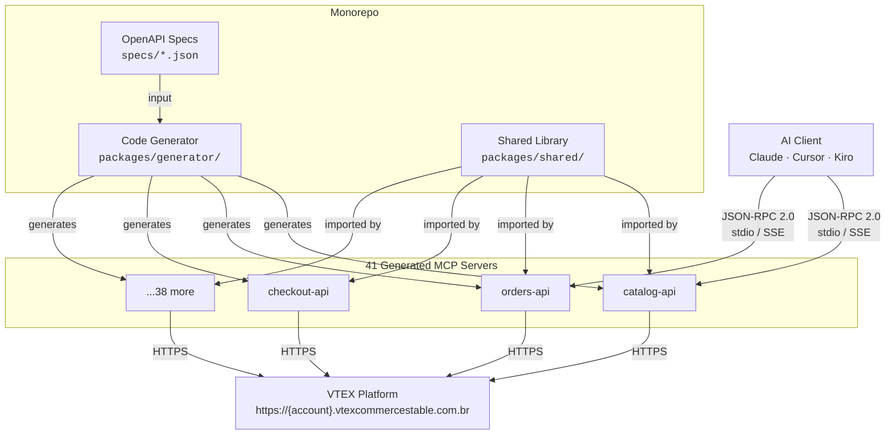

<p align="center">
  
  
  
  
  
  
</p>

# VTEX MCP Servers

**41 standalone [Model Context Protocol](https://modelcontextprotocol.io/) servers exposing every public VTEX e-commerce API to AI assistants.**

Each VTEX API group is its own MCP server — install only what you need via `npx`, configure your credentials, and let Claude, Cursor, Kiro, or any MCP-compatible client interact with your VTEX store.

All servers are auto-generated from official [VTEX OpenAPI specifications](https://github.com/vtex/openapi-schemas), ensuring tools stay accurate and in sync with the platform.

---

## Why?

VTEX has 40+ API groups with hundreds of endpoints. Manually wiring each one into an AI assistant is tedious and error-prone. This project solves that:

- **One command** to run any VTEX API as an MCP server
- **1,669 tools** covering catalog, orders, checkout, payments, logistics, and more
- **Zero hand-written boilerplate** — a code generator reads OpenAPI specs and produces fully typed, validated MCP servers
- **Credential sanitization** built in — API keys never leak through error messages

---

## Quick Start

### 1. Run a server

```bash
npx @vtex-mcp/catalog-api
```

### 2. Set your credentials

```bash
export VTEX_ACCOUNT_NAME=mystore
export VTEX_APP_KEY=vtexappkey-mystore-ABCDEF
export VTEX_APP_TOKEN=your-app-token
```

### 3. Connect your AI client


**Claude Desktop** — add to `claude_desktop_config.json`:

```json
{
  "mcpServers": {
    "vtex-catalog": {
      "command": "npx",
      "args": ["@vtex-mcp/catalog-api"],
      "env": {
        "VTEX_ACCOUNT_NAME": "mystore",
        "VTEX_APP_KEY": "your-app-key",
        "VTEX_APP_TOKEN": "your-app-token"
      }
    }
  }
}
```

**Cursor** — add to `.cursor/mcp.json`:

```json
{
  "mcpServers": {
    "vtex-catalog": {
      "command": "npx",
      "args": ["@vtex-mcp/catalog-api"],
      "env": {
        "VTEX_ACCOUNT_NAME": "mystore",
        "VTEX_APP_KEY": "your-app-key",
        "VTEX_APP_TOKEN": "your-app-token"
      }
    }
  }
}
```

**Kiro** — add to `.kiro/settings/mcp.json`:

```json
{
  "mcpServers": {
    "vtex-catalog": {
      "command": "npx",
      "args": ["@vtex-mcp/catalog-api"],
      "env": {
        "VTEX_ACCOUNT_NAME": "mystore",
        "VTEX_APP_KEY": "your-app-key",
        "VTEX_APP_TOKEN": "your-app-token"
      }
    }
  }
}
```

> Mix and match — add as many servers as you need. Each one is independent.

---

## Running from Source (Custom Setup)

If you want to fork, modify, or run the servers locally without npm:

```bash
# 1. Clone the repo
git clone https://github.com/v-hansen/vtex_mcps.git
cd vtex-mcp-servers

# 2. Install dependencies
pnpm install

# 3. Build everything
pnpm build

# 4. Run any server directly
node servers/catalog-api/dist/cli.js
```

Then point your MCP client to the local path instead of `npx`:

```json
{
  "mcpServers": {
    "vtex-catalog": {
      "command": "node",
      "args": ["/absolute/path/to/vtex-mcp-servers/servers/catalog-api/dist/cli.js"],
      "env": {
        "VTEX_ACCOUNT_NAME": "mystore",
        "VTEX_APP_KEY": "your-app-key",
        "VTEX_APP_TOKEN": "your-app-token"
      }
    }
  }
}
```

This is useful if you want to:
- Customize tool behavior or add custom tools
- Use a private fork with internal modifications
- Test changes before publishing
- Run servers without depending on the npm registry

You can also regenerate any server after modifying the shared library or generator:

```bash
# Rebuild the generator
pnpm build --filter @vtex-mcp/generator

# Regenerate a specific server
npx vtex-mcp-generator \
  --spec specs/catalog-api.json \
  --output servers/catalog-api \
  --name "@vtex-mcp/catalog-api" \
  --server-name "VTEX Catalog API"

# Rebuild the server
pnpm build --filter @vtex-mcp/catalog-api
```

---

## Authentication

| Variable | Required | Description |
|---|---|---|
| `VTEX_ACCOUNT_NAME` | Yes | Your VTEX account name |
| `VTEX_APP_KEY` | Yes* | App key from VTEX License Manager |
| `VTEX_APP_TOKEN` | Yes* | App token paired with the key |
| `VTEX_AUTH_TOKEN` | No | User token (alternative to key/token pair) |
| `VTEX_ENVIRONMENT` | No | API environment (default: `vtexcommercestable`) |

\* Required unless `VTEX_AUTH_TOKEN` is provided.

---

## Transport Modes

Every server supports two transport modes:

| Mode | Flag | Use Case |
|---|---|---|
| **stdio** (default) | `--transport stdio` | Local MCP clients (Claude Desktop, Cursor, Kiro) |
| **HTTP/SSE** | `--transport http --port 3000` | Remote deployment, multi-client scenarios |

```bash
# stdio (default)
npx @vtex-mcp/orders-api

# HTTP with custom port
npx @vtex-mcp/orders-api --transport http --port 8080
```

---

## Available Servers

<details>
<summary><strong>41 servers — click to expand full list</strong></summary>

| Server | Package | Tools |
|---|---|---|
| Antifraud Provider | [`@vtex-mcp/antifraud-provider-api`](https://www.npmjs.com/package/@vtex-mcp/antifraud-provider-api) | Antifraud provider integration |
| Brand | [`@vtex-mcp/brand-api`](https://www.npmjs.com/package/@vtex-mcp/brand-api) | Brand management |
| Catalog | [`@vtex-mcp/catalog-api`](https://www.npmjs.com/package/@vtex-mcp/catalog-api) | Products, SKUs, categories, specs (193 tools) |
| Category | [`@vtex-mcp/category-api`](https://www.npmjs.com/package/@vtex-mcp/category-api) | Category tree management |
| Checkout | [`@vtex-mcp/checkout-api`](https://www.npmjs.com/package/@vtex-mcp/checkout-api) | Cart and checkout operations |
| CMS (Legacy) | [`@vtex-mcp/cms-legacy-portal-api`](https://www.npmjs.com/package/@vtex-mcp/cms-legacy-portal-api) | Legacy CMS portal |
| Collection (Beta) | [`@vtex-mcp/collection-beta-api`](https://www.npmjs.com/package/@vtex-mcp/collection-beta-api) | Product collections |
| Customer Credit | [`@vtex-mcp/customer-credit-api`](https://www.npmjs.com/package/@vtex-mcp/customer-credit-api) | Customer credit management |
| Gift Card | [`@vtex-mcp/giftcard-api`](https://www.npmjs.com/package/@vtex-mcp/giftcard-api) | Gift card operations |
| Gift Card Hub | [`@vtex-mcp/giftcard-hub-api`](https://www.npmjs.com/package/@vtex-mcp/giftcard-hub-api) | Gift card hub integration |
| Gift Card Provider | [`@vtex-mcp/giftcard-provider-protocol`](https://www.npmjs.com/package/@vtex-mcp/giftcard-provider-protocol) | Gift card provider protocol |
| Headless CMS | [`@vtex-mcp/headless-cms-api`](https://www.npmjs.com/package/@vtex-mcp/headless-cms-api) | Headless CMS content |
| Intelligent Search Events | [`@vtex-mcp/intelligent-search-events-api`](https://www.npmjs.com/package/@vtex-mcp/intelligent-search-events-api) | Search analytics |
| Inventory | [`@vtex-mcp/inventory-api`](https://www.npmjs.com/package/@vtex-mcp/inventory-api) | Inventory management |
| License Manager | [`@vtex-mcp/license-manager-api`](https://www.npmjs.com/package/@vtex-mcp/license-manager-api) | Users, roles, permissions |
| Logistics | [`@vtex-mcp/logistics-api`](https://www.npmjs.com/package/@vtex-mcp/logistics-api) | Shipping and logistics |
| Marketplace | [`@vtex-mcp/marketplace-api`](https://www.npmjs.com/package/@vtex-mcp/marketplace-api) | Marketplace operations |
| Master Data v2 | [`@vtex-mcp/master-data-api-v2`](https://www.npmjs.com/package/@vtex-mcp/master-data-api-v2) | Master Data v2 |
| Master Data v10 | [`@vtex-mcp/master-data-api-v10`](https://www.npmjs.com/package/@vtex-mcp/master-data-api-v10) | Master Data v10.2 |
| Message Center | [`@vtex-mcp/message-center-api`](https://www.npmjs.com/package/@vtex-mcp/message-center-api) | Transactional messages |
| Orders | [`@vtex-mcp/orders-api`](https://www.npmjs.com/package/@vtex-mcp/orders-api) | Order management |
| Payment Provider | [`@vtex-mcp/payment-provider-protocol`](https://www.npmjs.com/package/@vtex-mcp/payment-provider-protocol) | Payment provider integration |
| Payments | [`@vtex-mcp/payments-api`](https://www.npmjs.com/package/@vtex-mcp/payments-api) | Payment transactions |
| Payments Gateway | [`@vtex-mcp/payments-gateway-api`](https://www.npmjs.com/package/@vtex-mcp/payments-gateway-api) | Payment gateway |
| Pickup Points | [`@vtex-mcp/pickup-points-api`](https://www.npmjs.com/package/@vtex-mcp/pickup-points-api) | Pickup point management |
| Policies System | [`@vtex-mcp/policies-system-api`](https://www.npmjs.com/package/@vtex-mcp/policies-system-api) | Policy management |
| Pricing | [`@vtex-mcp/pricing-api`](https://www.npmjs.com/package/@vtex-mcp/pricing-api) | Price management |
| Promotions & Taxes | [`@vtex-mcp/promotions-and-taxes-api`](https://www.npmjs.com/package/@vtex-mcp/promotions-and-taxes-api) | Promotions and tax rules |
| Rates and Benefits | [`@vtex-mcp/rates-and-benefits-api`](https://www.npmjs.com/package/@vtex-mcp/rates-and-benefits-api) | Rates and benefits |
| Reviews and Ratings | [`@vtex-mcp/reviews-and-ratings-api`](https://www.npmjs.com/package/@vtex-mcp/reviews-and-ratings-api) | Product reviews |
| Search | [`@vtex-mcp/search-api`](https://www.npmjs.com/package/@vtex-mcp/search-api) | VTEX Intelligent Search |
| Session Manager | [`@vtex-mcp/session-manager-api`](https://www.npmjs.com/package/@vtex-mcp/session-manager-api) | Session management |
| Shipping Network | [`@vtex-mcp/shipping-network-api`](https://www.npmjs.com/package/@vtex-mcp/shipping-network-api) | Shipping carriers |
| SKU Bindings | [`@vtex-mcp/sku-bindings-api`](https://www.npmjs.com/package/@vtex-mcp/sku-bindings-api) | SKU binding management |
| Specification | [`@vtex-mcp/specification-api`](https://www.npmjs.com/package/@vtex-mcp/specification-api) | Product specifications |
| Subscriptions | [`@vtex-mcp/subscriptions-api`](https://www.npmjs.com/package/@vtex-mcp/subscriptions-api) | Subscription management |
| Suggestions | [`@vtex-mcp/suggestions-api`](https://www.npmjs.com/package/@vtex-mcp/suggestions-api) | Marketplace suggestions |
| Tracking | [`@vtex-mcp/tracking-api`](https://www.npmjs.com/package/@vtex-mcp/tracking-api) | Order tracking |
| VTEX DO | [`@vtex-mcp/vtex-do-api`](https://www.npmjs.com/package/@vtex-mcp/vtex-do-api) | Task management |
| VTEX ID | [`@vtex-mcp/vtex-id-api`](https://www.npmjs.com/package/@vtex-mcp/vtex-id-api) | Authentication and identity |
| Warehouse | [`@vtex-mcp/warehouse-api`](https://www.npmjs.com/package/@vtex-mcp/warehouse-api) | Warehouse management |

</details>

Each server has its own `README.md` with the full tool list. See `servers/{api-group}/README.md`.

---

## Architecture



### How it works

1. **OpenAPI specs** from VTEX's official repo are downloaded into `specs/`
2. The **code generator** parses each spec, converts JSON Schema to Zod validators, and scaffolds a complete MCP server package
3. Each **generated server** registers tools with the MCP protocol, validates inputs, calls the VTEX API, and returns structured responses
4. The **shared library** provides the HTTP client (with auth injection), error handling (with credential sanitization), and the MCP server factory

### Request flow

```
AI Client → tools/call { name, arguments }
         → Parameter validation (Zod)
         → VTEX API request (with auth headers)
         → Response formatting
         → AI Client receives structured result
```

---

## Project Structure

```
vtex-mcp-servers/
├── packages/
│   ├── shared/              # HTTP client, auth, validation, error handling, MCP server factory
│   └── generator/           # OpenAPI spec → MCP server code generator
├── servers/                 # 41 generated MCP server packages
├── specs/                   # VTEX OpenAPI specification files
├── .github/
│   ├── workflows/           # CI (build + test) and publish (npm) workflows
│   ├── ISSUE_TEMPLATE/      # Bug report and feature request templates
│   └── PULL_REQUEST_TEMPLATE.md
├── docker-compose.yml       # Run all 41 servers locally
├── package.json             # Root workspace config
├── pnpm-workspace.yaml      # Workspace package globs
└── tsconfig.base.json       # Shared TypeScript config
```

---

## Development

```bash
# Clone and install
git clone https://github.com/v-hansen/vtex_mcps.git
cd vtex-mcps
pnpm install

# Build everything
pnpm build

# Run all 161 tests
pnpm test

# Lint and format
pnpm lint
pnpm format
```

### Generate a new server from an OpenAPI spec

```bash
npx vtex-mcp-generator \
  --spec specs/my-api.json \
  --output servers/my-api \
  --name "@vtex-mcp/my-api" \
  --server-name "VTEX My API"
```

### Run all servers via Docker

```bash
cp .env.example .env
# Edit .env with your credentials
docker compose up
```

See [CONTRIBUTING.md](CONTRIBUTING.md) for the full development guide.

---

## Testing

The project uses **vitest** for unit tests and **fast-check** for property-based tests, covering 15 formal correctness properties.

```bash
pnpm test          # Run all 161 tests across all packages
pnpm test --watch  # Watch mode for development
```

| Package | Tests | Coverage |
|---|---|---|
| `@vtex-mcp/shared` | 67 (8 unit + property test files) | Config, HTTP client, errors, validation, server factory |
| `@vtex-mcp/generator` | 80 (6 unit + property test files) | Parser, schema converter, tool generator, package generator |
| `@vtex-mcp/catalog-api` | 14 (integration tests) | JSON-RPC conformance, tools/list, error propagation, pagination |

---

## Contributing

We welcome contributions. See [CONTRIBUTING.md](CONTRIBUTING.md) for guidelines on:

- Adding new MCP servers
- Coding standards and naming conventions
- Testing requirements (unit + property-based)
- Pull request process

---

## Security

If you discover a security vulnerability, please see [SECURITY.md](SECURITY.md) for responsible disclosure instructions. Do not open a public issue.

---

## License

[MIT](LICENSE) — use it however you want.
