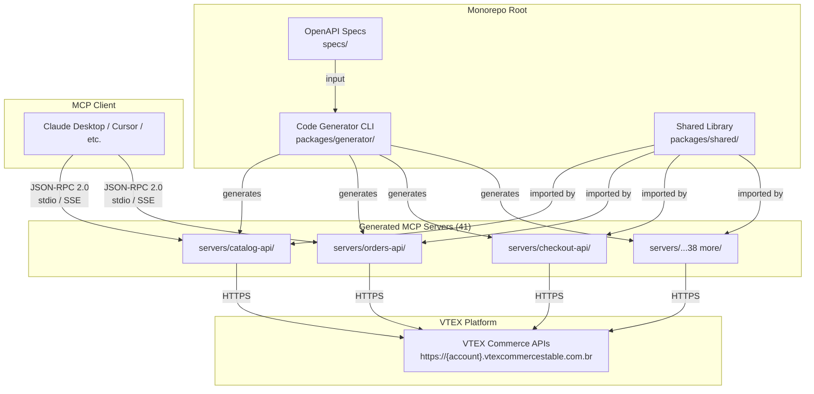

# VTEX MCP Servers

A collection of 41 [Model Context Protocol](https://modelcontextprotocol.io/) servers that expose every public VTEX e-commerce API to AI assistants. Each API group is a standalone MCP server — independently installable, configurable, and deployable as `@vtex-mcp/{api-group}`.

Built with TypeScript, generated from official VTEX OpenAPI specifications, and organized as a pnpm workspace monorepo.

## Architecture



## Quick Start

### Prerequisites

- Node.js >= 18
- pnpm >= 8
- VTEX account with API credentials

### Install and run a single server

```bash
# Run any server directly via npx
npx @vtex-mcp/catalog-api

# Or with HTTP/SSE transport
npx @vtex-mcp/catalog-api --transport http --port 3000
```

### Environment Variables

| Variable | Required | Description |
|---|---|---|
| `VTEX_ACCOUNT_NAME` | Yes | Your VTEX account name |
| `VTEX_APP_KEY` | Yes* | VTEX app key for authentication |
| `VTEX_APP_TOKEN` | Yes* | VTEX app token for authentication |
| `VTEX_AUTH_TOKEN` | No | Alternative auth token (replaces app key/token) |
| `VTEX_ENVIRONMENT` | No | VTEX environment (default: `vtexcommercestable`) |

\* Required unless `VTEX_AUTH_TOKEN` is provided.

## MCP Client Configuration

### Claude Desktop

Add to your `claude_desktop_config.json`:

```json
{
  "mcpServers": {
    "vtex-catalog": {
      "command": "npx",
      "args": ["@vtex-mcp/catalog-api"],
      "env": {
        "VTEX_ACCOUNT_NAME": "your-account",
        "VTEX_APP_KEY": "your-app-key",
        "VTEX_APP_TOKEN": "your-app-token"
      }
    },
    "vtex-orders": {
      "command": "npx",
      "args": ["@vtex-mcp/orders-api"],
      "env": {
        "VTEX_ACCOUNT_NAME": "your-account",
        "VTEX_APP_KEY": "your-app-key",
        "VTEX_APP_TOKEN": "your-app-token"
      }
    }
  }
}
```

### Cursor

Add to your `.cursor/mcp.json`:

```json
{
  "mcpServers": {
    "vtex-catalog": {
      "command": "npx",
      "args": ["@vtex-mcp/catalog-api"],
      "env": {
        "VTEX_ACCOUNT_NAME": "your-account",
        "VTEX_APP_KEY": "your-app-key",
        "VTEX_APP_TOKEN": "your-app-token"
      }
    }
  }
}
```

> Add as many servers as you need — each one is independent. See the full list below.

## Available Servers

| Server | Package | Description |
|---|---|---|
| Antifraud Provider API | `@vtex-mcp/antifraud-provider-api` | Antifraud provider integration |
| Brand API | `@vtex-mcp/brand-api` | Brand management |
| Catalog API | `@vtex-mcp/catalog-api` | Product catalog management |
| Category API | `@vtex-mcp/category-api` | Category tree management |
| Checkout API | `@vtex-mcp/checkout-api` | Cart and checkout operations |
| CMS (Legacy Portal) | `@vtex-mcp/cms-legacy-portal-api` | Legacy CMS portal |
| Collection API (Beta) | `@vtex-mcp/collection-beta-api` | Product collections |
| Customer Credit API | `@vtex-mcp/customer-credit-api` | Customer credit management |
| Gift Card API | `@vtex-mcp/gift-card-api` | Gift card operations |
| Gift Card Hub API | `@vtex-mcp/gift-card-hub-api` | Gift card hub integration |
| Gift Card Provider Protocol | `@vtex-mcp/gift-card-provider-protocol` | Gift card provider protocol |
| Headless CMS API | `@vtex-mcp/headless-cms-api` | Headless CMS content management |
| Intelligent Search Events API | `@vtex-mcp/intelligent-search-events-api` | Search analytics events |
| Inventory API | `@vtex-mcp/inventory-api` | Inventory management |
| License Manager API | `@vtex-mcp/license-manager-api` | License and user management |
| Logistics API | `@vtex-mcp/logistics-api` | Logistics and shipping |
| Marketplace API | `@vtex-mcp/marketplace-api` | Marketplace operations |
| Master Data API v2 | `@vtex-mcp/master-data-api-v2` | Master Data v2 |
| Master Data API v10 | `@vtex-mcp/master-data-api-v10` | Master Data v10.2 |
| Message Center API | `@vtex-mcp/message-center-api` | Transactional message templates |
| Orders API | `@vtex-mcp/orders-api` | Order management |
| Payment Provider Protocol | `@vtex-mcp/payment-provider-protocol` | Payment provider integration |
| Payments API | `@vtex-mcp/payments-api` | Payment transactions |
| Payments Gateway API | `@vtex-mcp/payments-gateway-api` | Payment gateway operations |
| Pickup Points API | `@vtex-mcp/pickup-points-api` | Pickup point management |
| Policies System API | `@vtex-mcp/policies-system-api` | Policy management |
| Pricing API | `@vtex-mcp/pricing-api` | Price management |
| Promotions & Taxes API | `@vtex-mcp/promotions-and-taxes-api` | Promotions and tax rules |
| Rates and Benefits API | `@vtex-mcp/rates-and-benefits-api` | Rates and benefits |
| Reviews and Ratings API | `@vtex-mcp/reviews-and-ratings-api` | Product reviews and ratings |
| Search API | `@vtex-mcp/search-api` | VTEX Intelligent Search |
| Session Manager API | `@vtex-mcp/session-manager-api` | Session management |
| Shipping Network API | `@vtex-mcp/shipping-network-api` | Shipping network carriers |
| SKU Bindings API | `@vtex-mcp/sku-bindings-api` | SKU binding management |
| Specification API | `@vtex-mcp/specification-api` | Product specifications |
| Subscriptions API | `@vtex-mcp/subscriptions-api` | Subscription management |
| Suggestions API | `@vtex-mcp/suggestions-api` | Marketplace suggestions |
| Tracking API | `@vtex-mcp/tracking-api` | Order tracking |
| VTEX DO API | `@vtex-mcp/vtex-do-api` | Task management (VTEX DO) |
| VTEX ID API | `@vtex-mcp/vtex-id-api` | Authentication and identity |
| Warehouse API | `@vtex-mcp/warehouse-api` | Warehouse management |

Each server has its own README with the full list of available tools. See `servers/{api-group}/README.md`.

## Project Structure

```
vtex-mcp-servers/
├── packages/
│   ├── shared/              # @vtex-mcp/shared — HTTP client, auth, validation, MCP server factory
│   └── generator/           # @vtex-mcp/generator — OpenAPI spec → MCP server code generator
├── servers/                 # 41 generated MCP server packages
│   ├── catalog-api/
│   ├── orders-api/
│   ├── checkout-api/
│   └── ...
├── specs/                   # VTEX OpenAPI specification files
├── .github/workflows/       # CI/CD (build, test, publish)
├── docker-compose.yml       # Run all servers locally
├── pnpm-workspace.yaml
└── tsconfig.base.json
```

## Development

### Setup

```bash
# Clone and install
git clone https://github.com/your-org/vtex-mcp-servers.git
cd vtex-mcp-servers
pnpm install

# Build all packages
pnpm build

# Run all tests
pnpm test
```

### Generate a new server

```bash
# Generate a server from an OpenAPI spec
pnpm --filter @vtex-mcp/generator start -- \
  --spec specs/my-api.json \
  --output servers/my-api/ \
  --name "@vtex-mcp/my-api" \
  --server-name "VTEX My API"
```

### Docker

```bash
# Start all servers via docker-compose
docker-compose up
```

See [CONTRIBUTING.md](CONTRIBUTING.md) for detailed development guidelines.

## License

[MIT](LICENSE)
